# 🔔 InstaNotify — Complete Architecture, Data Flow & UX Audit

> **Project**: Intelligent Notification System (Instagram-like social platform with smart notifications)  
> **Date**: February 17, 2026  
> **Scope**: Full-stack architecture analysis, data flow documentation, and UX/DX roast

---

## Table of Contents

1. [System Architecture Overview](#1-system-architecture-overview)
2. [Microservice Breakdown](#2-microservice-breakdown)
3. [Database Schema Design](#3-database-schema-design)
4. [Complete Data Flow Walkthroughs](#4-complete-data-flow-walkthroughs)
5. [Frontend Architecture](#5-frontend-architecture)
6. [Infrastructure & DevOps](#6-infrastructure--devops)
7. [🔥 UX/DX Roast — Every Issue Found](#7--uxdx-roast--every-issue-found)
8. [Summary & Priority Matrix](#8-summary--priority-matrix)

---

## 1. System Architecture Overview

### High-Level Architecture


### Service Port Map

| Service | Port | Protocol | Purpose |
|---------|------|----------|---------|
| Frontend | 5173 | HTTP | React dev server |
| Ingestion API | 3001 | HTTP | Event ingestion |
| Notification API | 3002 | HTTP | Notification history & preferences |
| Social API | 3003 | HTTP | Auth, posts, comments, likes, follows |
| Socket Service | 4000 | WS | Real-time push delivery |
| PostgreSQL | 5432 | TCP | Primary database |
| Redis | 6379 | TCP | Caching & aggregation windows |
| Kafka | 9092 | TCP | Message broker |
| DynamoDB | 8000 | HTTP | Notification logs (optional) |

---

## 2. Microservice Breakdown

### 2.1 Social API (`backend/social-api` → :3003)

**Role**: The main user-facing API. Handles all social platform features.

| Route | Method | Auth | Purpose |
|-------|--------|------|---------|
| `/api/auth/register` | POST | No | User registration (bcrypt + JWT) |
| `/api/auth/login` | POST | No | User login |
| `/api/users/:userId` | GET | Optional | Get user profile |
| `/api/users/:userId` | PATCH | Required | Update profile |
| `/api/users?q=search` | GET | No | Search users |
| `/api/posts` | GET | Optional | Get feed (all posts) |
| `/api/posts` | POST | Required | Create post |
| `/api/posts/:postId/like` | POST | Required | Like/unlike toggle |
| `/api/comments` | GET | No | Get comments for post |
| `/api/comments` | POST | Required | Add comment |
| `/api/follows/:userId` | POST | Required | Follow/unfollow toggle |
| `/api/follows/:userId/followers` | GET | No | Get followers list |
| `/api/follows/:userId/bell` | POST | Required | Toggle bell subscription |
| `/api/test/*` | Various | No | Test/simulation routes |

**Internal behavior**: On like, comment, follow, or bell-post actions, the Social API publishes a `NotificationEvent` to the appropriate Kafka topic based on priority.

---

### 2.2 Processing Service (`backend/processing-service`)

**Role**: The brain of the notification system. Consumes raw events from Kafka, applies aggregation logic, checks user preferences, and produces "ready" notifications.

**Three Kafka Consumer Groups (by priority)**:


**Aggregation Logic (Smart Batching)**:

| Event Type | Count | Behavior |
|-----------|-------|----------|
| LIKE | 1–3 | **Instant** — delivered immediately |
| LIKE | 4+ | **Batched** — held in 60s window, aggregated as "X and Y others liked..." |
| COMMENT | Any | **Always Batched** — held in 60s aggregation window |
| FOLLOW | 1–3 | **Instant** |
| FOLLOW | 4+ | **Batched** |
| BELL_POST | Any | **Instant** |
| CRITICAL (OTP, etc.) | Any | **Instant** — bypasses all aggregation |

**Aggregation flush job**: Runs every 30 seconds, checks Redis for expired aggregation windows, generates aggregated messages, stores to PostgreSQL, and produces to `ready-notifications` topic.

---

### 2.3 Socket Service (`backend/socket-service` → :4000)

**Role**: Real-time push delivery via WebSocket. Consumes from `ready-notifications` Kafka topic and pushes to connected clients.

**Flow**:
1. Client connects via Socket.io → emits `join_room` with `userId`
2. Server tracks user rooms and connection state
3. Kafka consumer receives ready notifications → emits `notification` event to user's room
4. Client receives real-time notification in browser

---

### 2.4 Notification API (`backend/notification-api` → :3002)

**Role**: Serves notification history from PostgreSQL. All endpoints are protected with JWT + IDOR prevention.

| Endpoint | Purpose |
|----------|---------|
| `GET /api/notifications/:userId` | Paginated notification history |
| `GET /api/notifications/:userId/unread-count` | Unread count (by priority) |
| `PATCH /api/notifications/:id/read` | Mark single notification as read |
| `PATCH /api/notifications/:userId/read-all` | Mark all as read |
| `DELETE /api/notifications/:id` | Delete a notification |
| `GET /api/notifications/:userId/grouped` | Grouped by type |

---

### 2.5 Ingestion API (`backend/ingestion-service` → :3001)

**Role**: General-purpose event ingestion endpoint for testing and external integrations. Produces events directly to Kafka.

---

### 2.6 Email Service (`backend/email-service`)

**Role**: Consumes from `ready-notifications` topic, sends emails via SendGrid API for notifications routed to the EMAIL channel.

### 2.7 SMS Service (`backend/sms-service`)

**Role**: Consumes from `ready-notifications` topic, sends SMS via Twilio API for notifications routed to the SMS channel.

### 2.8 Shared Module (`backend/shared`)

**Role**: Contains shared TypeScript types, Prisma schema, Redis cache service, middleware (tracing, auth), and utility functions used across all services.

---

## 3. Database Schema Design

### Entity-Relationship Diagram


**Key design decisions**:
- `Like` has a composite unique constraint on `(postId, userId)` — prevents double-likes
- `Follow` has a composite unique constraint on `(followerId, followingId)`
- `Comment` uses self-referential relation for nested replies
- `NotificationHistory` stores aggregation metadata (count, actor IDs) for "X and Y others" display
- `KafkaFallbackQueue` provides reliability when Kafka is down — events are stored in PostgreSQL and replayed later

---

## 4. Complete Data Flow Walkthroughs

### 4.1 Like Flow (End-to-End)


### 4.2 Comment Flow


### 4.3 Follow Flow


### 4.4 Bell Post Flow


### 4.5 Authentication Flow


### 4.6 Priority-Based Channel Routing


---

## 5. Frontend Architecture

### Component Tree


### State Management

| State | Location | Description |
|-------|----------|-------------|
| Auth (user, token) | `AuthContext` + `localStorage` | JWT-based, persisted across sessions |
| Socket connection | `SocketProvider` | WebSocket with exponential backoff reconnection |
| Notifications | `SocketProvider` state | Live notifications + fetched history merged |
| Unread count | `SocketProvider` state | Incremented on new notification, reset on markAsRead |
| Feed posts | `Feed` local state | Fetched on mount, no real-time updates |
| Current page | `AppContent` local state | Page-based navigation (no URL routing) |

---

## 6. Infrastructure & DevOps

### Docker Compose Services


**Key configuration notes**:
- Kafka runs in **KRaft mode** (no ZooKeeper dependency)
- Redis configured with `allkeys-lru` eviction and AOF persistence
- PostgreSQL uses `password123` as default password (⚠️ insecure)
- All services have health checks configured
- No backend services are containerized — only infrastructure

---

## 7. 🔥 UX/DX Roast — Every Issue Found

### Severity Legend

| Severity | Meaning |
|----------|---------|
| 🔴 **CRITICAL** | Broken functionality, security risk, or data integrity issue |
| 🟠 **HIGH** | Major UX degradation, confusing behavior |
| 🟡 **MEDIUM** | Annoying but workable, inconsistency |
| 🟢 **LOW** | Polish, nice-to-have improvement |

---

### 🔴 CRITICAL Issues

#### C1. NotificationBell Uses Hardcoded User ID Instead of Auth Context

**File**: [NotificationBell.tsx](file:///d:/Study/Udemy/New%20folder/Personal%20extra-projects/Notification_System/notification-system/frontend/src/components/NotificationBell.tsx#L8-L9)

```typescript
const CURRENT_USER_ID = 'user_999'; // Should come from auth context
const API_BASE = 'http://localhost:3002';
```

**Impact**: The notification bell dropdown fetches notifications for a nonexistent user `user_999` instead of the actual logged-in user. This means:
- Notification history dropdown is **always empty** for real users
- Mark-all-as-read calls fail silently
- Mark-as-read calls go to wrong user

**Fix**: Use `useAuth()` hook to get `user.id` and use the centralized `NOTIFICATION_API_URL` from `config/api.ts`.

---

#### C2. Notification Preferences Don't Actually Save

**File**: [NotificationPreferences.tsx](file:///d:/Study/Udemy/New%20folder/Personal%20extra-projects/Notification_System/notification-system/frontend/src/components/NotificationPreferences.tsx#L62-L73)

```typescript
const handleSave = async () => {
    console.log('Saving preferences:', preferences); // ← Just logs, never calls API
    setSaved(true);
    setTimeout(() => setSaved(false), 3000);
};
```

**Impact**: Users see a "✓ Preferences Saved" success message but nothing is actually persisted to the backend. When they refresh, all preferences reset to defaults. This is **deceptive UI** — the worst kind of UX bug.

**Fix**: Replace with actual API call to `PATCH /api/preferences/:userId`.

---

#### C3. Preferences Are Not Loaded from Backend Either

**File**: [NotificationPreferences.tsx](file:///d:/Study/Udemy/New%20folder/Personal%20extra-projects/Notification_System/notification-system/frontend/src/components/NotificationPreferences.tsx#L19-L29)

The component initializes preferences with hardcoded defaults and never fetches the user's actual preferences from the API. Combined with C2, the entire Preferences page is completely non-functional — it's pure UI theater.

---

#### C4. Socket Service Has No Authentication

**File**: [socket-service/server.ts](file:///d:/Study/Udemy/New%20folder/Personal%20extra-projects/Notification_System/notification-system/backend/socket-service/src/server.ts#L39-L50)

```typescript
socket.on('join_room', (userId: string) => {
    socket.join(userId);  // ← No auth check, anyone can join any room
});
```

**Impact**: Any client can connect and join any user's room to receive their notifications in real-time. This is a **privacy/security vulnerability**.

**Fix**: Verify JWT token on connection handshake or on `join_room` event.

---

#### C5. Test Routes Exposed in Production Without Auth

**File**: [social-api/server.ts](file:///d:/Study/Udemy/New%20folder/Personal%20extra-projects/Notification_System/notification-system/backend/social-api/src/server.ts#L51)

```typescript
app.use('/api/test', testRouter); // No auth, no env check
```

**Impact**: Anyone can hit `/api/test/simulate-likes`, `/api/test/simulate-comments`, and `/api/test/cleanup` to create fake data, spam likes/comments, or **delete test data** from the database. There is no auth middleware and no environment check.

---

### 🟠 HIGH Issues

#### H1. PostTester Embedded in Every Feed Post

**File**: [Feed.tsx](file:///d:/Study/Udemy/New%20folder/Personal%20extra-projects/Notification_System/notification-system/frontend/src/components/Feed.tsx#L588-L599)

Every single post in the feed renders a `PostTester` component at the bottom with a "🧪 Notification Tester" expandable panel. This is a developer testing tool visible to all users.

**Impact**: Cluttered feed, confusing UI for real users, exposes internal system behavior (aggregation windows, batch timing).

**Fix**: Gate behind an environment variable or admin role, or move to the dedicated Tester page only.

---

#### H2. Dev/Debug Tools Exposed in Navbar

**File**: [Navbar.tsx](file:///d:/Study/Udemy/New%20folder/Personal%20extra-projects/Notification_System/notification-system/frontend/src/components/Navbar.tsx#L61-L89)

The navbar shows **8 icons** to every user including:
- 🧪 **Flask** → Notification Tester (dev tool)
- 📊 **Dashboard** → System Dashboard (Kafka stats, Redis monitoring)
- 💾 **Database** → Database Viewer (raw DB tables)

**Impact**: Overwhelming navbar, non-user-facing tools in production UI, information leakage (DB contents visible to users).

**Fix**: Hide debug tools behind an admin flag, environment variable, or separate route.

---

#### H3. No URL-Based Routing (React Router Missing)

**File**: [App.tsx](file:///d:/Study/Udemy/New%20folder/Personal%20extra-projects/Notification_System/notification-system/frontend/src/App.tsx#L20-L25)

```typescript
type Page = 'feed' | 'preferences' | 'profile' | 'tester' | 'dashboard' | 'database';
const [currentPage, setCurrentPage] = useState<Page>('feed');
```

**Impact**:
- No browser back/forward navigation
- No shareable URLs (e.g., can't link to a profile or post)
- Refreshing always resets to feed
- No deep linking support

**Fix**: Add React Router with proper routes: `/`, `/profile/:userId`, `/settings`, `/post/:postId`, etc.

---

#### H4. Search Button is a Dead Button

**File**: [Navbar.tsx](file:///d:/Study/Udemy/New%20folder/Personal%20extra-projects/Notification_System/notification-system/frontend/src/components/Navbar.tsx#L35-L40)

```typescript
<button className="p-2 hover:bg-gray-800 rounded-lg" aria-label="Search">
    <Search size={24} />
</button>
```

The Search icon in the navbar has no `onClick` handler. It renders but does absolutely nothing. Users expect to find people/posts.

---

#### H5. Share and Bookmark Buttons are Non-Functional

**File**: [Feed.tsx](file:///d:/Study/Udemy/New%20folder/Personal%20extra-projects/Notification_System/notification-system/frontend/src/components/Feed.tsx#L464-L476)

Both the Share and Bookmark buttons in every post card render icons but have no functionality attached.

---

#### H6. Feed Has No Pagination or Infinite Scroll

**File**: [Feed.tsx](file:///d:/Study/Udemy/New%20folder/Personal%20extra-projects/Notification_System/notification-system/frontend/src/components/Feed.tsx#L59-L109)

The feed fetches all posts in a single API call with no pagination parameters. As data grows, this will:
- Cause increasingly slow load times
- Use excessive memory
- Make the initial load feel sluggish

---

#### H7. Inconsistent API URL Configuration

Multiple components hardcode `API_BASE = 'http://localhost:3003'` or `API_BASE = 'http://localhost:3002'` instead of using the centralized `config/api.ts`:

| File | Hardcoded URL |
|------|---------------|
| [NotificationBell.tsx:L9](file:///d:/Study/Udemy/New%20folder/Personal%20extra-projects/Notification_System/notification-system/frontend/src/components/NotificationBell.tsx#L9) | `http://localhost:3002` |
| [UserProfile.tsx:L12](file:///d:/Study/Udemy/New%20folder/Personal%20extra-projects/Notification_System/notification-system/frontend/src/components/UserProfile.tsx#L12) | `http://localhost:3003` |
| [PostCreation.tsx:L10](file:///d:/Study/Udemy/New%20folder/Personal%20extra-projects/Notification_System/notification-system/frontend/src/components/PostCreation.tsx#L10) | `http://localhost:3003` |
| [AuthContext.tsx:L20](file:///d:/Study/Udemy/New%20folder/Personal%20extra-projects/Notification_System/notification-system/frontend/src/context/AuthContext.tsx#L20) | `http://localhost:3003` |

The centralized `config/api.ts` exists and is used by `Feed.tsx`, `PostTester.tsx`, and `SocketProvider.tsx` — but not consistently everywhere.

---

#### H8. N+1 Query Problem in Feed Loading

**File**: [Feed.tsx](file:///d:/Study/Udemy/New%20folder/Personal%20extra-projects/Notification_System/notification-system/frontend/src/components/Feed.tsx#L82-L101)

```typescript
// Fetch follow status for ALL post authors
const uniqueUserIds = Array.from(new Set(fetchedPosts.map((p) => p.userId)));
const followStatuses = await Promise.all(
    uniqueUserIds.map(async (userId) => {
        const followRes = await axios.get(`${SOCIAL_API_URL}/api/users/${userId}`, ...);
        ...
    })
);
```

After fetching the feed, the component makes **one API call per unique post author** to check follow status. With 20 unique authors, that's 20 sequential API calls on every feed load.

**Fix**: The backend should return `isFollowing` status directly in the feed response (it already returns `isLiked`).

---

#### H9. Post Creation Only Supports Image URLs — No File Upload

**File**: [PostCreation.tsx](file:///d:/Study/Udemy/New%20folder/Personal%20extra-projects/Notification_System/notification-system/frontend/src/components/PostCreation.tsx#L108-L120)

Users must paste an image URL to add an image. There's no file upload, drag-and-drop, or camera integration. For an Instagram-like app, this is a fundamental missing feature.

---

#### H10. No Logout Button in Navbar

**File**: [Navbar.tsx](file:///d:/Study/Udemy/New%20folder/Personal%20extra-projects/Notification_System/notification-system/frontend/src/components/Navbar.tsx)

There are 8 icons in the navbar but no logout button or user menu. Users have to manually clear localStorage to log out (or find if there's a logout somewhere in the profile page — there isn't one visible).

---

### 🟡 MEDIUM Issues

#### M1. CORS Hardcoded to localhost

**File**: [social-api/server.ts](file:///d:/Study/Udemy/New%20folder/Personal%20extra-projects/Notification_System/notification-system/backend/social-api/src/server.ts#L25)

```typescript
app.use(cors({ origin: 'http://localhost:5173', credentials: true }));
```

Will break if deployed anywhere. Should come from environment variable.

---

#### M2. Duplicate Type Definitions

Frontend types in [frontend/src/types/index.ts](file:///d:/Study/Udemy/New%20folder/Personal%20extra-projects/Notification_System/notification-system/frontend/src/types/index.ts) and backend types in [backend/shared/types.ts](file:///d:/Study/Udemy/New%20folder/Personal%20extra-projects/Notification_System/notification-system/backend/shared/types.ts) define the same interfaces independently. They can drift out of sync.

---

#### M3. Feed Component Also Defines Its Own `Post` and `Comment` Interfaces

**File**: [Feed.tsx](file:///d:/Study/Udemy/New%20folder/Personal%20extra-projects/Notification_System/notification-system/frontend/src/components/Feed.tsx#L9-L41)

Feed.tsx defines its own `Post` and `Comment` interfaces that differ from the ones in `types/index.ts` (e.g., Feed's `Post` has `_count` while the global `Post` has `likesCount` directly). This creates type confusion.

---

#### M4. `alert()` Used for Error Handling

Multiple components use browser `alert()` for error feedback:
- [Feed.tsx:L122](file:///d:/Study/Udemy/New%20folder/Personal%20extra-projects/Notification_System/notification-system/frontend/src/components/Feed.tsx#L122): "Please login to like posts"
- [Feed.tsx:L172](file:///d:/Study/Udemy/New%20folder/Personal%20extra-projects/Notification_System/notification-system/frontend/src/components/Feed.tsx#L172): "Failed to like post"
- [Feed.tsx:L208](file:///d:/Study/Udemy/New%20folder/Personal%20extra-projects/Notification_System/notification-system/frontend/src/components/Feed.tsx#L208): "Failed to follow user"

Using `alert()` blocks the UI thread and feels unprofessional. Should use toast notifications (the system already has `ToastNotification.tsx`).

---

#### M5. Loading States Are Plain Text

Loading indicators across the app are just text strings ("Loading posts...", "Loading comments..."). The `UserProfile` uses a spinner, but `Feed` uses plain text. Inconsistent loading UX.

---

#### M6. Comment Avatar Uses Different API Than Post Avatar

- Posts use `ui-avatars.com/api/?name=...`
- Comments use `api.dicebear.com/7.x/avataaars/svg?seed=...`

This creates visual inconsistency — the same user's avatar looks different in the post header vs their comment. Should use a consistent fallback avatar source.

---

#### M7. No Error Recovery in SocketProvider on Max Retries

**File**: [SocketProvider.tsx](file:///d:/Study/Udemy/New%20folder/Personal%20extra-projects/Notification_System/notification-system/frontend/src/context/SocketProvider.tsx#L48-L52)

After 10 failed reconnection attempts, the console logs "Max reconnection attempts reached" but there's no UI feedback to the user. They have no idea their real-time notifications are dead. The `ConnectionStatus` component exists but may not always be visible.

---

#### M8. Edit Profile Button Does Nothing

**File**: [UserProfile.tsx](file:///d:/Study/Udemy/New%20folder/Personal%20extra-projects/Notification_System/notification-system/frontend/src/components/UserProfile.tsx#L158-L163)

The "Edit Profile" button on your own profile page has no `onClick` handler. It's purely decorative.

---

#### M9. Docker Compose Uses Insecure Default Credentials

**File**: [docker-compose.yml](file:///d:/Study/Udemy/New%20folder/Personal%20extra-projects/Notification_System/notification-system/docker-compose.yml#L9-L11)

```yaml
POSTGRES_USER: admin
POSTGRES_PASSWORD: password123
```

These should be environment variables, not hardcoded in the compose file.

---

#### M10. View All Notifications Button Does Nothing

**File**: [NotificationBell.tsx](file:///d:/Study/Udemy/New%20folder/Personal%20extra-projects/Notification_System/notification-system/frontend/src/components/NotificationBell.tsx#L210-L212)

The "View All Notifications" link at the bottom of the notification dropdown has no click handler.

---

#### M11. Settings Icon in Notification Dropdown Does Nothing

**File**: [NotificationBell.tsx](file:///d:/Study/Udemy/New%20folder/Personal%20extra-projects/Notification_System/notification-system/frontend/src/components/NotificationBell.tsx#L147-L152)

The Settings gear icon in the notification panel header has no click handler. It should navigate to Notification Preferences.

---

### 🟢 LOW Issues

#### L1. No Unit or Integration Tests

The project has zero custom tests — no Jest, Vitest, or any testing framework configured. All `.test` files found are from `node_modules`.

---

#### L2. Feed Component is 607 Lines

[Feed.tsx](file:///d:/Study/Udemy/New%20folder/Personal%20extra-projects/Notification_System/notification-system/frontend/src/components/Feed.tsx) (607 lines) handles fetching, liking, following, commenting, user profile navigation, and renders PostTester. This is a god-component that should be broken down.

---

#### L3. `any` Types Used in Error Handling

Multiple files use `err: any` or cast to `any` in catch blocks, losing TypeScript's type safety benefits.

---

#### L4. Missing `React` Import in NotificationItem

[NotificationItem.tsx](file:///d:/Study/Udemy/New%20folder/Personal%20extra-projects/Notification_System/notification-system/frontend/src/components/NotificationItem.tsx#L1) uses `React.FC` but doesn't import `React`. This works with modern JSX transform but is inconsistent with other files.

---

#### L5. No Mobile Responsiveness

The navbar with 8 icons horizontally doesn't collapse or adaptto mobile screens. No hamburger menu, bottom nav, or responsive breakpoints observed.

---

#### L6. Post Images Are Fixed Height

```typescript
className="w-full h-96 object-cover"
```

All post images are forced to `h-96` (384px) regardless of aspect ratio, cropping landscape and portrait photos inconsistently.

---

#### L7. Token Expiry Not Handled Proactively

The JWT token can expire while the user is using the app. There's no token refresh mechanism. The app only detects this on the next API call failure (401), at which point it calls `window.location.reload()` — losing any unsaved state.

---

## 8. Summary & Priority Matrix

### Issue Counts by Severity

| Severity | Count | Examples |
|----------|-------|---------|
| 🔴 Critical | 5 | Hardcoded user ID, fake save, no socket auth, exposed test routes |
| 🟠 High | 10 | PostTester in feed, dead buttons, no routing, N+1 queries |
| 🟡 Medium | 11 | CORS hardcoded, alert() errors, inconsistent avatars |
| 🟢 Low | 7 | No tests, god-component, no mobile support |

### Recommended Fix Priority

```mermaid
graph TD
    subgraph "Phase 1: Fix What's Broken 🛑"
        C1["C1: Fix NotificationBell user ID"]
        C2["C2+C3: Wire Preferences to API"]
        C4["C4: Add Socket auth"]
        C5["C5: Gate test routes"]
    end

    subgraph "Phase 2: UX Foundations 🏗️"
        H3["H3: Add React Router"]
        H7["H7: Centralize API URLs"]
        H1["H1: Remove PostTester from feed"]
        H2["H2: Hide dev tools"]
        H10["H10: Add logout"]
    end

    subgraph "Phase 3: Features & Polish ✨"
        H4["H4: Implement Search"]
        H6["H6: Add pagination"]
        H8["H8: Fix N+1 queries"]
        H9["H9: Image upload"]
        M4["M4: Replace alert() with toasts"]
    end

    subgraph "Phase 4: Hardening 🔒"
        M1["M1: Dynamic CORS"]
        M9["M9: Secure Docker credentials"]
        L1["L1: Add tests"]
        L5["L5: Mobile responsiveness"]
        L7["L7: Token refresh"]
    end
```



---

> **Total Issues Found: 33**  
> **Verdict**: The backend architecture is actually well-designed (priority-based Kafka topics, aggregation service, fallback queue, proper IDOR protection on notification API). The frontend is where most pain lives — it reads like a prototype that grew features without refactoring. The biggest wins come from fixing the 5 Critical items (especially NotificationBell and Preferences) and adding React Router.
